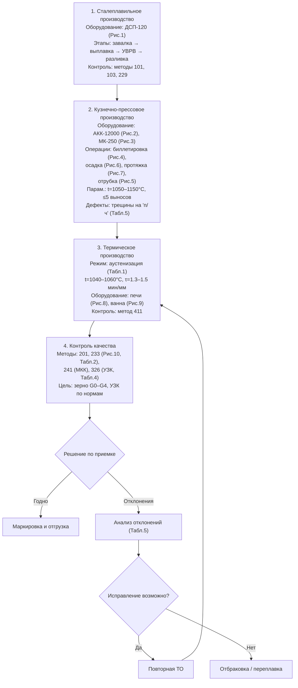

# Блок-схема стандартизации технологического процесса изготовления заготовок из аустенитной стали 08Х18Н10Т

> **НИР Лебедева Н.В., группа ММТ-24-13, МИСиС, 23.06.2025**  
> Научный руководитель: к.ф.-м.н. Иванов И.А.  
> Цель: анализ влияния термодеформационных режимов на величину зерна и УЗК (см. стр. 1–13 НИР)

