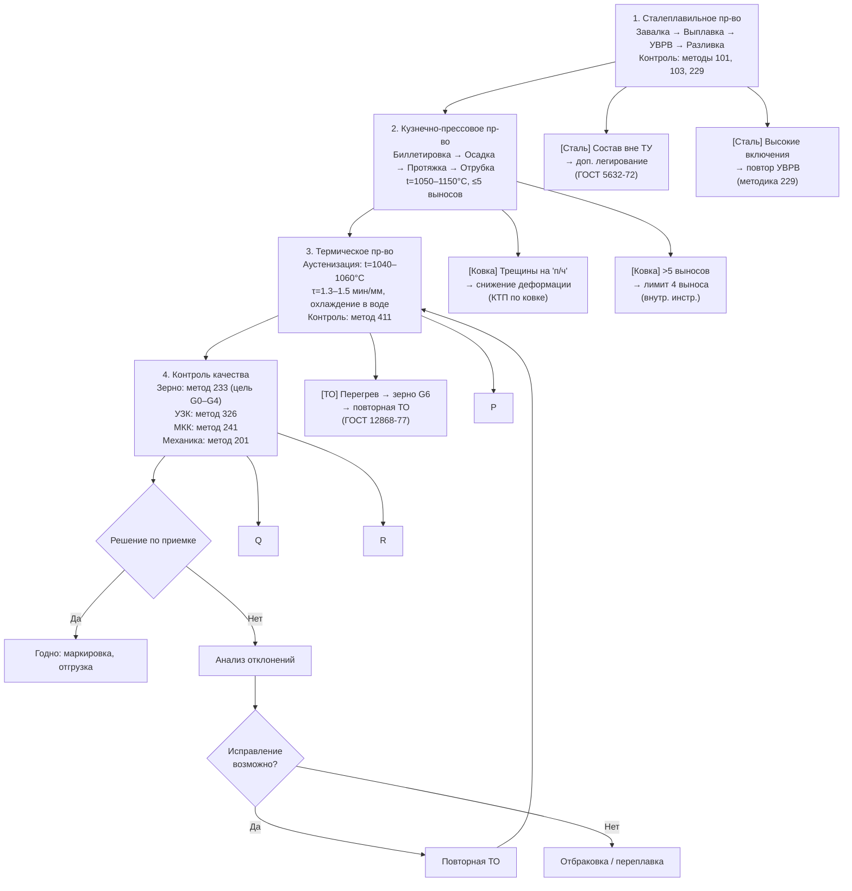

# Блок-схема стандартизации технологического процесса изготовления заготовок из аустенитной стали 08Х18Н10Т

> **НИР Лебедева Н.В., группа ММТ-24-13, МИСиС**   
> Основано на анализе термодеформационных режимов с требованиями по **величине зерна** и **ультразвуковому контролю (УЗК)**.

    P["[ТО] Медленное охлаждение\n→ усиление перемешивания\n(методика 411)"]
    Q["[УЗК] Не пройден\n→ зачистка/отбраковка\n(Табл.4)"]
    R["[Зерно] G6\n→ согласование или переплавка\n(ПНАЭГ-7-008-89)"]
