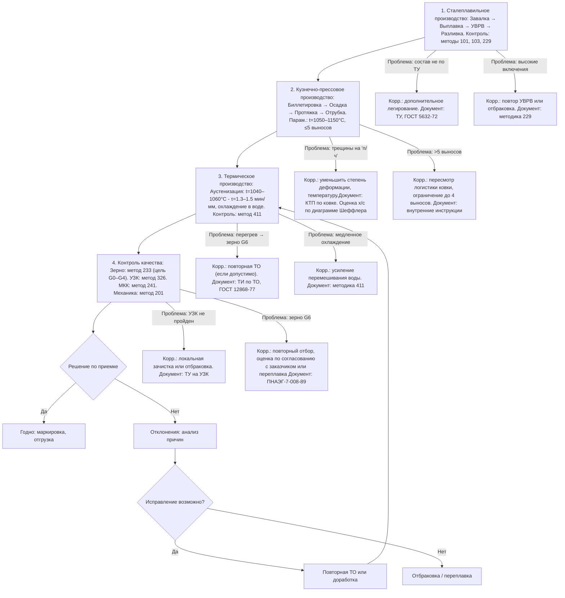

# Блок-схема стандартизации технологического процесса изготовления заготовок из аустенитной стали 08Х18Н10Т

> **НИР Лебедева Н.В., группа ММТ-24-13, МИСиС**   
> Основано на анализе термодеформационных режимов с требованиями по **величине зерна** и **ультразвуковому контролю (УЗК)**.

